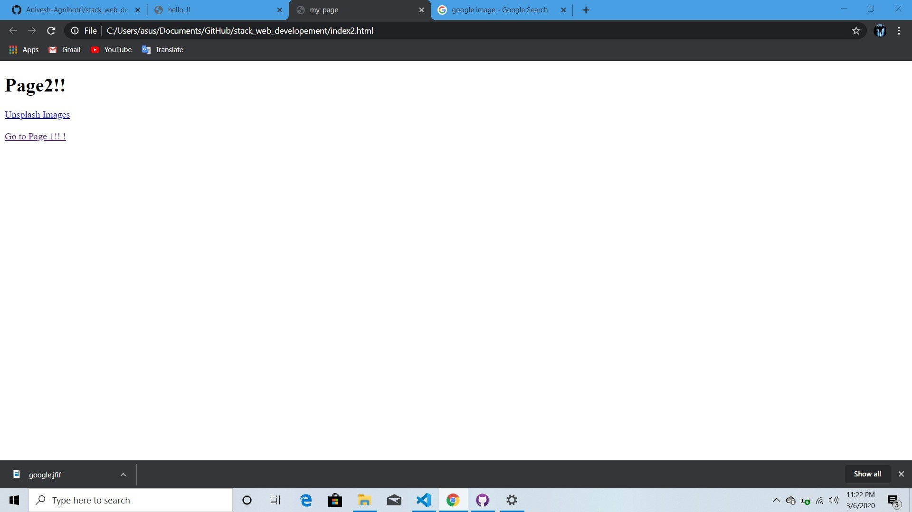
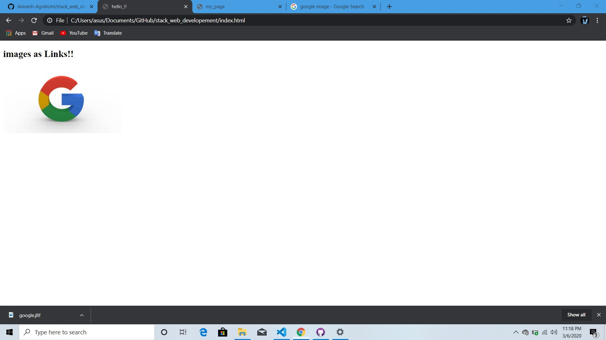

# stack_web_developement
 
till now we have learn - 
h1 , h2 till h6 -> they are heading tags, their size decrease form h1 to h6. 
p -> this is used to create  paragraphs. 
br -> this is used to change line in our web page . it is self closing. 
ul & ol -> they are list tags, ul for unorder list and ol for order list. 
img -> yhis is image tag ,used with src attribute whic provide the location of image. 
a -> this is anchor tag, it is used to creat links 
as we have made a page 2 by this

  
we can also use image as a link:   

